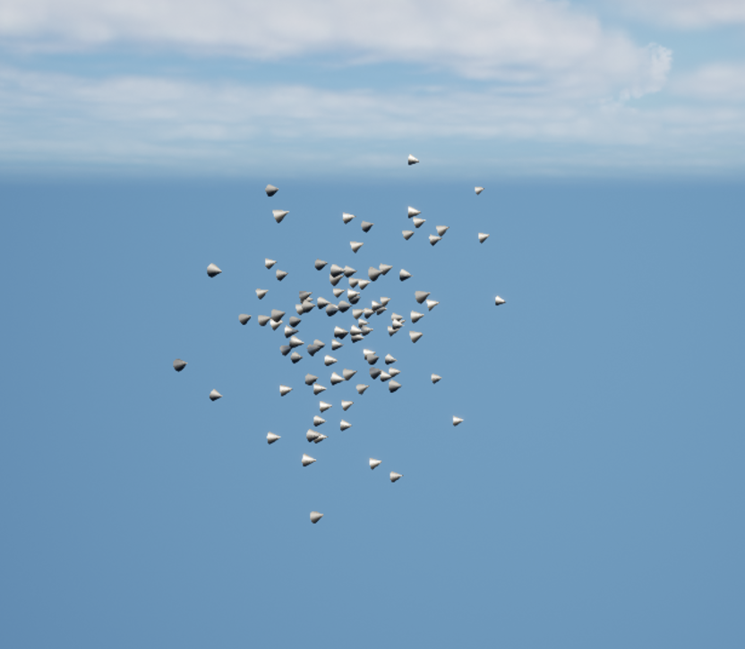
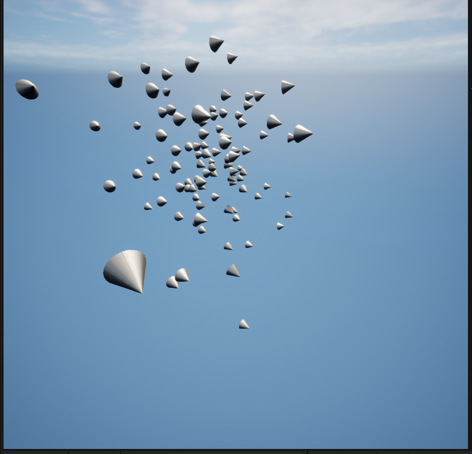
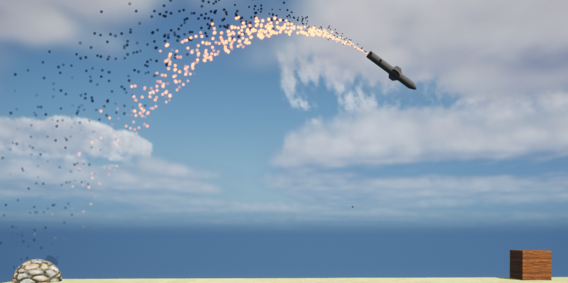
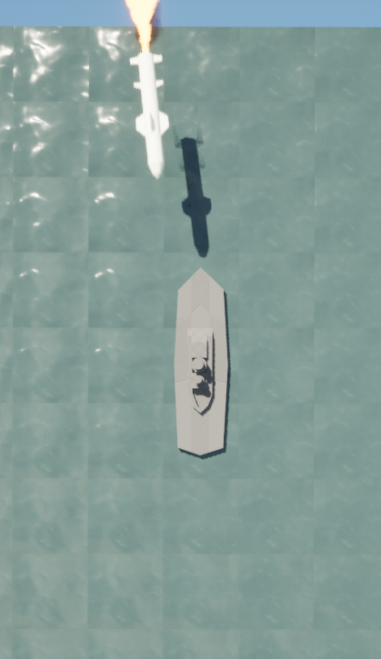
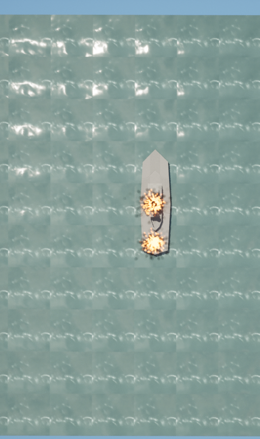
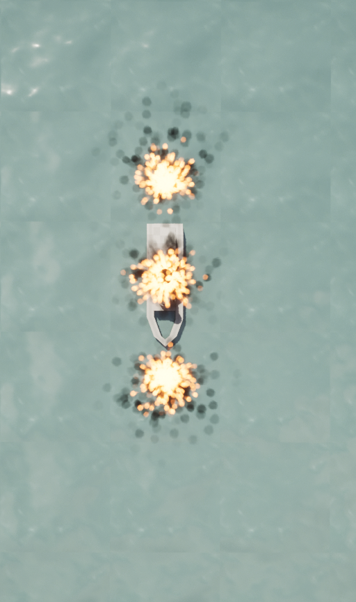

# Projects
Repository for Unreal and Unity Projects.

## Contents:

- [Unreal](#unreal-projects)

- [Unity](#unity-projects)

## Unreal Projects

- [Bloxorz](#bloxorz)
  
- [Cosmic Horror](#untitled-cosmic-horror-game)

- [Boids](#boids)

- [Battleship](#battleships)

# Bloxorz
A modern reimagining of the web classic Bloxorz. 
The game is made using Unreal Engine, the programming is done almost entirely in Unreal's flavour of C++ apart from certain UI related functionality.

## Contents:
- [Videos](#videos)

- [Images](#images)

- [Controls](#controls)

- [Rules](#rules)

## Videos

### Game Footage

https://github.com/Pablo-Arevalo-Escobar/Bloxorz/assets/63361048/37236d8a-9e62-4840-995d-06bab127583f

### Level Editor Footage

https://github.com/Pablo-Arevalo-Escobar/Bloxorz/assets/63361048/8e2c1627-5d69-4e8c-8eb3-275ebb07f7f4

## Images

### Level Examples

### SFX

## Controls
Movement:

W/UP_ARROW    = Move up

S/DOWN_ARROW  = Move down

A/LEFT_ARROW  = Move left

D/RIGHT_ARROW = Move right

Special:

SPACE = Toggle between the split cubes 

## Rules

### Tile Types

Black Tile:

  - The black tile is the end point of the level. It is the player's goal to make it here.

Bridge Tile:

  - The bridge tile can open new paths but must be activated by a switch!

Fall/Red Tile:

  - These tiles will fall whenever the player character is standing on top of them.

Torus Tile:
  - The torus tile splits your character into two at puts them at different points of the map.

Circle switches:

  - Circle switches are activated whenever the character is over them regardless if the character is flat or standing.

Cross switches:

  - Cross switches are activated whenever the character is standing over them. If the character is flat, the switch does 
    not react.

### Movement Counter

The amount of moves the player makes in each level is stored and used to calculate their overall score at the end (score feature is not yet implemented).

If the player falls, then the move count is reset to whatever it was at the beginning of the level.

# Untitled Cosmic Horror Game
An experiment in capturing the horror atmosphere.

## Images

### Portals 

### Lab 

### Outdoors

### Observatory

### Notes

# **Boids** 
A C++ Unreal implementation of simple boid behaviour based on the principles described by the following wikipedia page:
https://en.wikipedia.org/wiki/Boids

Three key steps in the algorithm:

1. Alignment:

- Steer towards the average heading of local flockmates
	
2. Separation:

- Steer to avoid local flockmates
	
3. Cohesion:

- Steer to move towards the average position (center of mass) of local flockmates
	
  
Current Screenshots:

# **BattleShips** 

A simple battleship game made in my free time using C++ and blueprints in Unreal Engine.

Current Screenshots:

## Unity Projects

### **Flappy Bird** January 2023

A flappy bird clone made over a weekend using Unity and Photoshop.
The purpose of this project was to learn the basic functionality of Unity.
Note - Game will automatically restart 2 seconds after you die

Controls:

Space -> Jump

Playable at: https://pablo-arevalo-escobar.github.io/Unreal-Unity/

